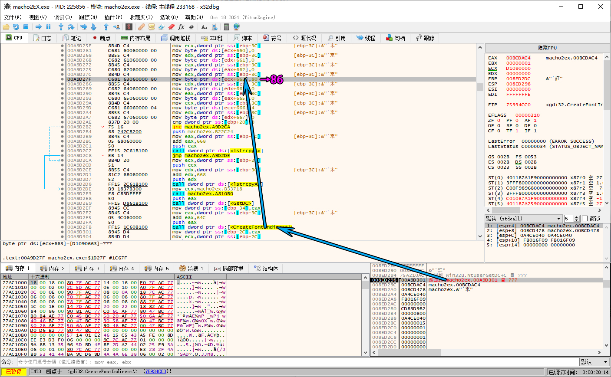
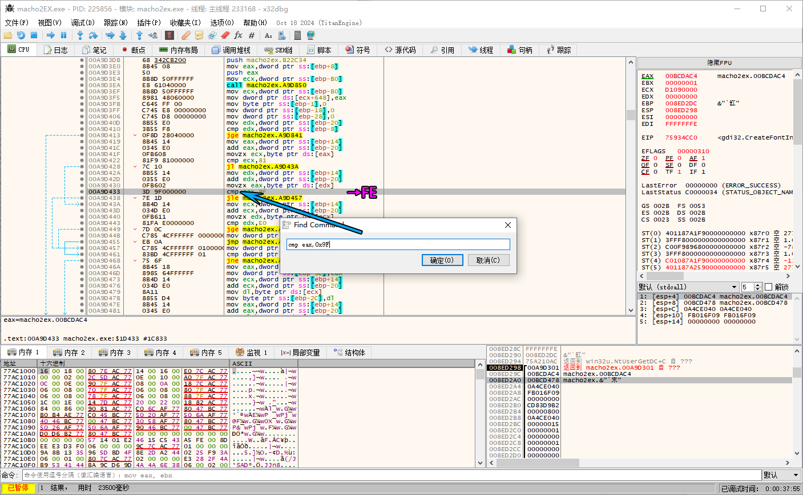
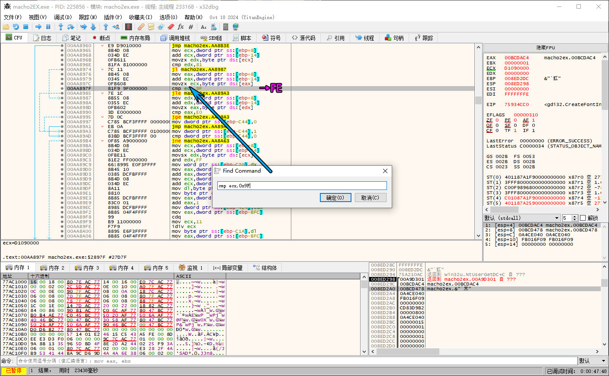
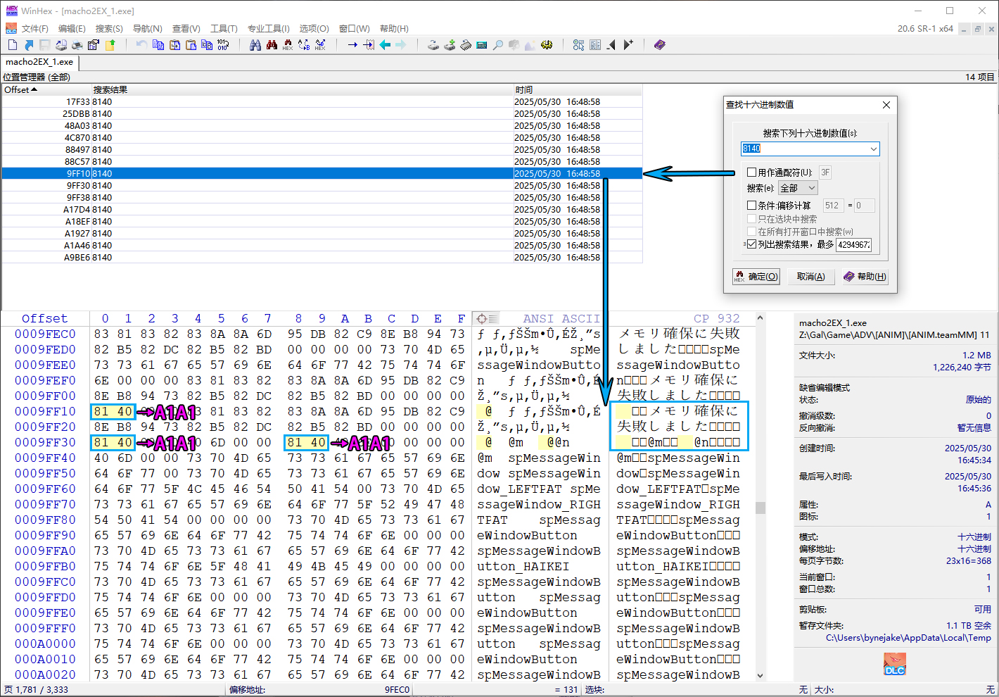

## 文本汉化
[SExtractor](https://github.com/satan53x/SExtractor)

## exe汉化

### 1. 修改编码
- 断点 `CreateFontIndirectA`

  

- `80` → `86`

  

### 2. 修改校验边界

- `cmp eax,0x9F` → `cmp eax,0xFE`

  
  
- `cmp ecx,0x9F` → `cmp ecx,0xFE`

  

### 3. 修复全角空格乱码

- `8140` → `A1A1`
  
  
